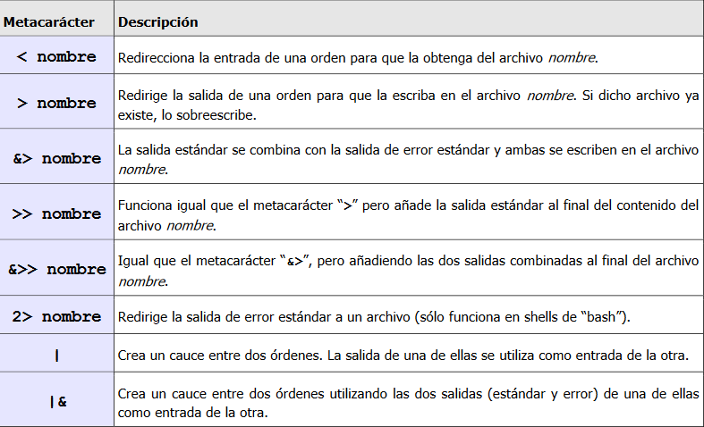

# Linux-Commands-and-Scripts
With this repository you can learn to use the terminal and even make scripts in Linux in a comfortable and organized way

## Órdenes Básicas

- Man → Instrucciones sobre cualquier comando.

```bash
man ls
```

- Ls → Lista el contenido de un directorio.

```bash
ls -l //formato amplio
ls -a //ocultos
ls -c //multicolumna
ls -r //inverso
ls -t //fecha
```

- Cd → Cambiar de directorio.

```bash
cd directorio
cd .. //Volver atrás
cd ../Directorio //Moverte a un directorio del directorio padre
cd ~ //Moverte al home.
```

- Pwd → Camino absoluto del directorio actual.
- Mkdir directorio → Crear una carpeta.
- Rmdir directorio → Borrar directorio si esta vacio.
- Cat → Muestra el contenido de un archivo o varios, concatena
archivos, copia un archivo, crea un archivo de texto o muestra los caracteres invisibles de control.
- Cp archivo1 archivo2 → Copia un archivo en el otro y si no existe lo crea.
- Mv fuente destino → Para mover archivos o directorios y renombrar.
- File → Tipo de archivo.
- More → Muestra archivo fraccionado.
- Rm → Borra archivos y directorios.
- Touch → Modifica fecha y hora y crea archivos.
- Clear → Limpia terminal.
- Head/Tail -lineas archivo → Muestran las n lineas iniciales/finales de un archivo.
- Sort → Ordena según criterio.
- Setterm -r → Reestablecer el estado normal de la terminal.

## Metacaracteres

- * → todo.
- ? → caracter.
- { → Sustituyen conjuntos de palabras separadas por comas que comparten partes comunes.
- [ → Designan un carácter o rango de caracteres que representan un carácter simple a través de una lista de caracteres o mediante un rango, en cuyo caso, mostramos el primer y último carácter del rango separados por un guión “-”.

### De recirección:



### Sintácticos:


```bash
$ date
Wed oct 6 10:12:04 WET 2010
$ pwd
/home/users/quasimodo
$ pwd ; date | wc
/home/users/quasimodo
1 6 27
$ (pwd ; date) | wc
2 7 48
$ pwd
/home/users/quasimodo
$ ls
listado notas
$ ls -l notas && pwd
-rw-r-—r-- 1 quasimodo alumnos 3418 Mar 15 2010 notas
/home/users/quasimodo
$ ls -l notas || pwd
-rw-r-—r-- 1 quasimodo alumnos 3418 Mar 15 2010 notas
$ rm notas
$ ls -l notas && pwd
ls: notas: No existe el archivo o el directorio
$ ls -l notas || pwd
ls: notas: No existe el archivo o el directorio
/home/users/quasimodo
```

- r → Lectura.

## Permisos

- w → Escritura.
- x → Ejecución.
- - → No hay permiso.

**Chmod**

Si hacemos ls -l vemos el listado de archivos y sus privilegios.

Se nos motrará algo así: rwx r - - r - -

Podemos definir entre:

u → usuario

g → grupo

o → otros

a → todos

Así podemos definir los permisos:

```bash
chmod (u/g/o/a)(+/-)(w/r/x) nombre_archivo.
```

Con números:

Va en binario

rwx r - - r - -

111 100 100

7       4     4

Esto sigue esta regla por ello podemos ejecutar chmod con números: chmod 744 nombre_archivo

## Echo

```bash
echo “hola”    //Imprime por terminal hola
```

```bash
(echo “hola”; ls -l) > nombre_fichero     //Mete dentro de el archivo hola y el ls
```

> escribe dentro de un fichero sustituyendo lo que había.

>> escribe dentro de un archivo sin sustituir lo que había.

>& escribe tambien dentro de el archivo el error por termimal y la orden.

>2 imprime la orden por terminal y mete en el archivo el error

A && B → Solo si A se cumple B también.

A | | B → Si A da error, hace B.

## Wc

Wc sirve para contar lineas (l), caracteres (c), palabras (w) … .

```bash
wc -c/-l/-w
$ ls
listado
notas
$ ls notas && wc notas || echo “no existe el archivo notas”
notas
86 324 5673 notas
$ rm notas
$ ls notas && wc notas || echo “no existe el archivo notas”
ls: notas: No existe el archivo o el directorio
no existe el archivo notas
```

## Variables

Podemos diferenciar las de entorno (comunes a todos los shells) se pueden mostrar con env o printenv y las locales, visible solo en la shell donde se definen y se pueden mostrar con set. help variables → variables bash. 

Podemos crear variables con atributos con declare, numérica (-i), (-p) para ver los atributos.

Podemos declarar las variables así:

```bash
numero=1
echo "$numero" //Imprime 1
colores=(rojo azul verde)
echo ${colores[0]} //Imprime rojo
$ declare -i IVA=18
$ declare -p IVA
declare -i IVA=”18”
$ declare -i IVA=hola
$ declare -p IVA
declare -i IVA="0"
//Cuidado: Sin espacios.
```

### Variables Especiales

<span>![</span><span>Si no carga pincha el enlace</span><span>]</span><span>(</span><span>https://raw.githubusercontent.com/SCR4T3/Linux-Commands-and-Scripts/master/Untitled 2.png</span><span>)</span>

Si reiniciamos la bash podemos perder las variables por eso podemos exportarlas con export variable o export variable=valor.

Comillas

‘ comillas simples para echo.

“comillas dobles para echo.

`comillas invertidas para ordenes o $(ls -l)

También podemos asignar resultados de ordenes a variables:

```bash
variable=`ls .`
```

Si queremos realizar operaciones con varibles podemos hacerlo con expr:

```bash
numero=`expr $numero + 1`
echo $numero //Imprime numero + 1
```

## Printf

Se puede escribe:

```bash
printf "mi nombre es %s y mi edad es %d"
```

<span>![</span><span>Si no carga pincha el enlace</span><span>]</span><span>(</span><span>https://raw.githubusercontent.com/SCR4T3/Linux-Commands-and-Scripts/master/Untitled 3.png</span><span>)</span>

<span>![</span><span>Si no carga pincha el enlace</span><span>]</span><span>(</span><span>https://raw.githubusercontent.com/SCR4T3/Linux-Commands-and-Scripts/master/Untitled 4.png</span><span>)</span>

```bash
$ printf “%10d\n” 25
25
$ printf “%-10d %-10d\n” 11 12
11 12
$ printf “%10.3f\n” 15,4
15,400
$ printf “%d %d\n” 010 0xF
8 15
$ printf “0%o 0x%x\n” 8 15
00 0xf
$ printf “El valor actual del IVA es del %d\n” $IVA
El valor actual del IVA es del 18
```

## Alias

Los alias se crean con la orden empotrada alias y se borran o eliminan con la orden unalias.

```bash
$ alias dir='ls -l'
$ dir
$ \ls –l $HOME //Para ignorar un alias se pone la barra \
```

## Find

```bash
find <directorio> <opcion> <patron>
$ find / -name "*.c" //nombre del archivo
$ find . -type f //archivos regulares (f), directorios (d)
$ find / ! -user pat //se puede negar cualquier opcion, aqui pat 
para buscar en la raiz los archivos que no pertenezcan al usuario.
$ find . -size 10 -o -atime +2 //-o para concatenar ordenes
$ find . -print
$ find . -atime +100 -exec rm {} \;
```

- atime 7 busca los archivos a los que se accedió hace 7 días.
- atime -2 busca los archivos a los que se accedió hace menos de 2 días.
- atime +5 busca los archivos a los que se accedió hace más de 5 días.
- Por su tamaño en bloques: se utiliza la opción -size seguida de un número con o sin signo (+ o -). Si el número va seguido de la letra c el tamaño dado es en bytes. Por ejemplo: -size 100 busca los archivos cuyo tamaño es de 100 bloques.
- -print: visualiza los nombres de camino de cada archivo que se adapta al criterio de búsqueda. Es la opción por defecto.
- -exec: permite añadir una orden que se aplicará a los archivos localizados. La orden se situará a continuación de la opción y debe terminarse con un espacio, un carácter \ y a continuación un ;. Se utiliza {} para representar el nombre de archivos localizados.
- -ok: es similar a -exec, con la excepción de que solicita confirmación en cada archivo localizado antes de ejecutar la orden

### Grep

Permite buscar cadenas en archivos utilizando patrones para especificar dicha cadena.

```bash
grep <opciones> <patron> <archivo>
$ grep mundo *
```

- -x localiza líneas que coincidan totalmente, desde el principio hasta el final de línea, con el patrón especificado.
- -v selecciona todas las líneas que no contengan el patrón especificado.
- -c produce solamente un recuento de las líneas coincidentes.
-i ignora las distinciones entre mayúsculas y minúsculas.
-n añade el número de línea en el archivo fuente a la salida de las coincidencias.
- -l selecciona sólo los nombres de aquellos archivos que coincidan con el patrón de búsqueda.
- -e especial para el uso de múltiples patrones e incluso si el patrón comienza por el carácter (-).

La orden fgrep acepta sólo una cadena simple de búsqueda en vez de una expresión regular. La orden egrep permite un conjunto más complejo de operadores en expresiones regulares.

## Guiones

Para ejecutarlo usamos bash nombrearchivo o ./nombrearchivo

Creamos imprimevar:

```bash
variable=ordenador
printf "Me acabo de comprar un $variable\n"
printf 'Me acabo de comprar un $variable\n'
printf "Me acabo de comprar un \$variable\n"
Devuelve
$ bash imprimevar
Me acabo de comprar un ordenador
Me acabo de comprar un $variable
Me acabo de comprar un $variable
```

Otro ejemplo:

```bash
#!/bin/bash
printf “El directorio $HOME contiene los siguientes archivos:\n”
ls $HOME
```

Variables

<span>![</span><span>Si no carga pincha el enlace</span><span>]</span><span>(</span><span>https://raw.githubusercontent.com/SCR4T3/Linux-Commands-and-Scripts/master/Untitled 5.png</span><span>)</span>

Los argumentos por encima del 9 se suelen ponen entre llaves, por ejemplo, ${12}^2.

Por ejemplo: 

```bash
#!/bin/bash
printf “El directorio $1 contiene los siguientes archivos:\n”
ls $1
```

En este caso justo al poner ./nombrearchivo tenemos que adjuntar el valor de las variable $n.

Otro ejemplo sencillo de guion bash sería el de realización de una copia en otro directorio de todos los archivos y subdirectorios del directorio home de un usuario. Al igual que antes, se abre el editor con el que más cómodos nos sintamos y escribimos lo siguiente: 

```bash
#!/bin/bash
printf "Haciendo copia de seguridad en $HOME...\n"
cp -r $HOME/* /tmp/backupuser/
printf "Copia realizada\n"
```

Para corregir dichos errores basta con leer el texto del mensaje que nos muestra en el terminal, observar el número de la línea en la que se indica la localización del error y si tras su análisis no se consigue solucionarlo, será necesario realizar una ejecución depurada del mismo. Para ello, podemos ejecutar nuestro guion con la orden bash y empleando una de las siguientes opciones:
-n: Chequea errores sintácticos pero sin ejecutar el guion.
-v: Visualiza cada orden del guion antes de ejecutarla.
-x: Actúa igual que –v sólo que sustituyendo, en su caso, las variables por los valores que tienen en ese instante.

Por ejemplo:

<span>![</span><span>Si no carga pincha el enlace</span><span>]</span><span>(</span><span>https://raw.githubusercontent.com/SCR4T3/Linux-Commands-and-Scripts/master/Untitled 6.png</span><span>)</span>

Para comentar un guion (#), es una buena práctica. Por ejemplo:

<span>![</span><span>Si no carga pincha el enlace</span><span>]</span><span>(</span><span>https://raw.githubusercontent.com/SCR4T3/Linux-Commands-and-Scripts/master/Untitled 7.png</span><span>)</span>

## Expresiones con variables

El shell bash ofrece dos posibles sintaxis para manejar expresiones aritméticas haciendo uso de lo que se denominaexpansión aritmética, o sustitución aritmética, que evalúa una expresión aritmética y sustituye el resultado de la expresión en el lugar donde se utiliza. Ambas posibilidades son:
$(( … ))
$[ … ]

Se pueden anidar. Por ejemplo:

```bash
$ echo “Faltan $(( (365 - $(date +%j)) / 7 )) semanas hasta el fin de año”
```

### Operadores

<span>![</span><span>Si no carga pincha el enlace</span><span>]</span><span>(</span><span>https://raw.githubusercontent.com/SCR4T3/Linux-Commands-and-Scripts/master/Untitled 8.png</span><span>)</span>

En el resultado del cálculo de expresiones aritméticas, bash solamente trabaja con números enteros, por lo que si se necesitase calcular un resultado con decimales, habría que utilizar una forma alternativa, como puede ser la ofrecida por la orden bc, cuya opción -l, letra “ele”, permite hacer algunos cálculos matemáticos (admite otras posibilidades que pueden verse mediante man).

Ejemplo:

```bash
$ echo 6/5|bc -l
```

### Operadores Relacionales

<span>![</span><span>Si no carga pincha el enlace</span><span>]</span><span>(</span><span>https://raw.githubusercontent.com/SCR4T3/Linux-Commands-and-Scripts/master/Untitled 9.png</span><span>)</span>

### Operadores de consulta de archivos

```bash
test <expresion> //true = 0 / false = 1
```

<span>![</span><span>Si no carga pincha el enlace</span><span>]</span><span>(</span><span>https://raw.githubusercontent.com/SCR4T3/Linux-Commands-and-Scripts/master/Untitled 10.png</span><span>)</span>

La orden test expresion es equivalente a la orden [ expresion ] (poner espacios entre corchetes).

### Asignación y variables aritméticas

```bash
let variableEntera=expresión //Cuidado, sin espacios en blanco
$ let w=3+2
$ let w='3 + 2'
$ let w='(4+5)*6'
$ let “w=4+5*6”
$ let w=4+5*6
$ y=7
$ let w=y%5
```

Las dos primeras asignaciones producen el mismo resultado, a pesar de que en la segunda hay espacios en blanco. Por el contrario, las asignaciones tercera y cuarta no dan el mismo resultado debido al uso o no de paréntesis. Las asignaciones cuarta y quinta son equivalentes, y las dos últimas ponen de manifiesto que en la expresión pueden intervenir otras variables.

Hemos de indicar que (( <expresión> )) equivale a la orden let y presenta ventajas como por ejemplo a la hora de hacer comparaciones numéricas para usarlas en ejecuciones condicionales:

```bash
//Ejemplo
$ a=10
$ ((a<10))
$ echo $?
1
$ ((a==10))
$ echo $?
0
$ if let 'a<10'; then echo “es menor”; else echo “es mayor o igual”; fi
es mayor o igual
//Se puede comprobar si la expresión (8>3)&&(9<5) es falsa, ya que la primera parte de ella es 
//verdadera, pero la segunda es falsa:
$ echo $[$[8>3]&&$[9<5]]
0
$ echo $[8>3] y $[9<5]
1 y 0

// Con operadores de consulta de archivos

$ test -d /bin # comprueba si /bin es un directorio
$ echo $? # nos muestra el estado de la última orden ejecutada, aunque
0 # usado después de test o [ ] da 0 si la evaluación era verdadera
$ [ -w /bin ] # comprueba si tenemos permiso de escritura en /bin
$ echo $? # usado después de test o [ ] da 1 si la evaluación era falsa
1
$ test -f /bin/cat # comprueba si el archivo /bin/cat existe y es plano
$ echo $?
0
$ [ /bin/cat -nt /bin/zz ] # comprueba si /bin/cat es más reciente que /bin/zz
$ echo $?
0 # la evaluación devuelve 1 porque /bin/zz no existe

//Ejemplo

$ cd /bin
$ ls -l cat
-rwxr-xr-x 1 root root 38524 2010-06-11 09:10 cat
$ xacceso=`test -x cat && echo “true” || echo “false”` # se pueden omitir las “”
$ echo $xacceso
true # indica que sí tenemos permiso de ejecución sobre cat
$ wacceso=`test -w cat && echo “true” || echo “false”` # se pueden omitir las “”
$ echo $wacceso
false # indica que no tenemos permiso de escritura en cat

//Ejemplo, también podemos combinarlas:

# Si el archivo “ejemplo” no tiene permisos de escritura
$ ls –la ejemplo
-rw-r--r-- 1 usuario usuario 256 29 nov 2016 ejemplo
$ ejemploNOT=`! test –x ejemplo && echo true || echo false`
$ echo $ejemploNOT
true
# Si es propiedad del usuario que ejecuta la orden y no está vacío
$ ejemploAND=`test –O ejemplo –a –s ejemplo && echo true || echo false`
$ echo $ejemploAND
true
# Si tiene permisos de lectura o de escritura
$ ejemploOR=`test –r ejemplo –o –w ejemplo && echo true || echo false`
$ echo $ejemploOR
true
```

## Orden if / else

La sintaxis de la orden condicional if es:

<span>![</span><span>Si no carga pincha el enlace</span><span>]</span><span>(</span><span>https://raw.githubusercontent.com/SCR4T3/Linux-Commands-and-Scripts/master/Untitled 11.png</span><span>)</span>

El funcionamiento de la orden if es el siguiente: se comienza haciendo la ejecución de la lista de órdenes contenidas en la primera condición; si su estado de salida es 0, entonces se ejecuta la lista de declaraciones que sigue a la palabra then y se termina la ejecución del if; si el estado de salida fuese 1, se comprueba si hay un bloque que comience por elif. En caso de haber varios bloques elif, se evalúa la condición del primero de ellos de forma que si su estado de salida es 0, se hace la parte then correspondiente y termina el if, pero si su estado de salida es 1, se continúa comprobando de manera análoga el siguiente bloque elif, si es que existe. Si el estado de salida de todas las condiciones existentes es 1, se comprueba si hay un bloque else, en cuyo caso se ejecutarían las declaraciones asociadas a él, y termina el if.

En el ejemplo siguiente se utiliza la orden if para tener una estructura similar a la que se había planteado anteriormente con test usando “&&” y “||”:

```bash
$ cd /bin
$ ls -l cat
-rwxr-xrx 1 root root 38524 2010-06-11 09:10 cat
$ xacceso=`if test -x cat; then echo “true”; else echo “false”; fi`
$ echo $xacceso
true # indica que sí tenemos permiso de ejecución sobre cat
$ wacceso=`if test -w cat; then echo “true”; else echo “false”; fi`
$ echo $wacceso
false # indica que no tenemos permiso de escritura en cat
```

Comparaciones Aritméticas

```bash
$ valor=34
$ if [ $valor == "34" ]; then echo sí; else echo no; fi # los huecos en blanco a los
sí # lados de los operadores
$ if [ $valor -eq "34" ]; then echo sí; else echo no; fi# relacionales son
sí # necesarios
$ if [ $valor == "40" ]; then echo sí; else echo no; fi
no
```

¡Cuidado!

```bash
$ if (( $var1 = 234 )); then echo sí; else echo no; fi no
-bash: ((: 234 = 234 : se intentó asignar a algo que no es una variable (el elemento
de error es "= 234 ")
no
```

Comparaciones entre cadenas de caracteres

```bash
$ valor=”hola”
$ if [ $valor = "hola" ]; then echo sí; else echo no; fi
sí
$ if [ $valor == "hola" ]; then echo sí; else echo no; fi
sí
$ if [ $valor=="adios" ]; then echo sí; else echo no; fi
si
$ if [ $valor == "adios" ]; then echo sí; else echo no; fi
no
$ if [ $valor != "adiós" ]; then echo sí; else echo no; fi
sí
```

¡Cuidado!

```bash
$ valor=”hola amigos”
$ if [ $valor == "hola amigos" ]; then echo sí; else echo no; fi
-bash: [: demasiados argumentos
no
$ if [ “$valor” == "hola amigos" ]; then echo sí; else echo no; fi
sí
```

Comparaciones usando órdenes

```bash
$ valor=6
$ if [ valor=3 ]; then echo sí; else echo no; fi
sí # se hace internamente la orden que hay entre corchetes y no
$ echo $valor # da error, pero la supuesta asignación en la condición del
6 # if no tiene efecto sobre la variable que se estaba usando
$ if ls > salida; then echo sí; else echo no; fi
sí # además, el if hace la orden ls sobre el archivo salida
$ cat salida # vemos que la orden ls anterior ha volcado su resultado en
# este archivo, poniendo cada nombre en una línea distinta
# e incluyendo también el nombre “salida”
$ valor=5
$ if valor=3 && ls ; then echo sí; else echo no; fi
# muestra el resultado de ls y otra línea con sí;
# además, hace la asignación correctamente, tal como podemos ver
$ echo $valor
3 # el if ha cambiado el contenido de la variable valor
$ if rm salida; then echo sí; else echo no; fi 2> sal
# en caso de que el archivo salida exista antes del if, se borra y
# escribe una línea en pantalla poniendo sí;
# en caso de que ese archivo no exista, escribe en pantalla una
# línea con no y pone un mensaje de error en el archivo sal
```

Ejercicios sesion 5

5.1

```bash
#!/bin/bash

if [ ! "$#" = 2 ]; then
        echo "Debe de introducir dos parametros"
fi

if [ -d "$1" ]; then
        DIRECTORY=$1
else
        echo "$1 no existe como directorio"
        exit 1
fi

if [ "$2" -gt 0 ]; then
        TAMANIO=$2
else
        echo "El segundo parametro introducido debe ser mayor que 0"
        exit 1
fi

find "$DIRECTORY" -size -"$TAMANIO">archivosSizN.txt
```

5.2

```bash
#!/bin/bash

if [ -d "$1" ]; then
        DIRECTORY=$1
fi

for archivo in $(ls "$DIRECTORY")
do
        if [ -d "$archivo" ]; then
                echo "$archivo -> Directorio"
        fi
        if [ -h "$archivo" ]; then
                echo "$archivo -> Enlace"
        fi
        if [ -O "$archivo" ]; then
                echo "$archivo -> Archivo"
        fi
done
```

5.5

```bash
#!/bin/bash

process=true

while "$process";
do
        read -p "Dime un numero: " NUMERO

        if [ "$NUMERO" -gt 1 ] && [ "$NUMERO" -lt 10 ]; then
                echo "Has proporcionado un numero correcto"
                process=false
        fi
done

printf "\nFin del programa"
```

5.7

```bash
!/bin/bash

TERM=$1

encontrado=false

for linea in $(cat /etc/shells)
do
        if [ "$linea" == "$TERM" ]; then
                encontrado=true
                break
         fi
done

if [ "$encontrado" == true ]; then
        for line in $(cat /etc/passwd | cut -d':' --fields=1,7)
        do
                if [ $(echo $line | cut -d':' -f2) == "$TERM" ]; then
                        echo $(echo $line | cut -d':' -f1)
                fi
        done
fi
```

5.8

```bash
#!/bin/bash

if [ -e $1 $2 $3 ]; then
        gzip $1 $2 $3
        if [ -d CopiasSeguridad ]; then
                tar -cvf copia$(date +"%y%m%d").tar.gz *.gz
        else
                mkdir CopiasSeguridad
                tar -cvf CopiasSeguridad/copia$(date +"%y%m%d").tar.gz *.gz
        fi
fi
```

5.9

```bash
dirname=$1
num_files=$2
basefilename=$3
a=0

if [ ! -d "$dirname" ]; then
    mkdir "$dirname"
    chmod +w "$dirname"
    chmod +r "$dirname"
else
    chmod +w "$dirname"
    chmod +r "$dirname"
fi

if [ "$#" -gt 1 ] && [ "$num_files" -gt 1 ] && [ "$num_files" -lt 99 ]; then
    while [ "$a" -lt "$num_files" ]; do
        touch "$dirname/$basefilename$a"
        a=$((a+1))
    done
fi
```

6.3

```bash
ps -eo cmd,pmem --sort -pmem | head -2 | tail -1
```

6.4

Desde otro terminal con la orden ps -e podemos ver el

identificador del proceso y con la función kill -SIGSTOP podemos

detenerlo, reanudarlo con kill -SIGCONT [PID] y finalizarlo con

kill -SIGTERM [PID].

<aside>
💡 Hecho por Alejandro Jordán Duran

</aside>
